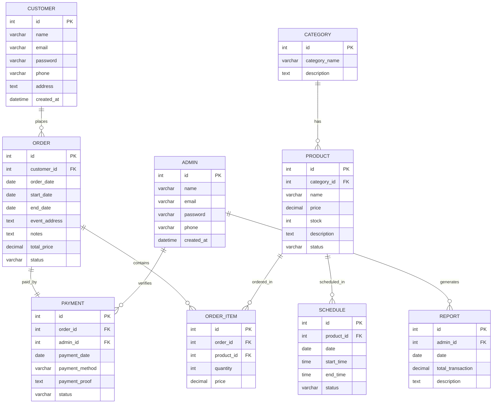

# Entity Relationship Diagram (ERD) - Wedding Decoration

Dokumen ini berisi rancangan basis data (database schema) untuk sistem penyewaan dekorasi pernikahan (_Wedding Decoration_). Rancangan ini digambarkan menggunakan diagram ERD (Mermaid) serta penjelasan kamus data untuk masing-masing tabel.

## Diagram ERD

---

## Kamus Data (Data Dictionary)

Berikut adalah detail struktur kolom untuk setiap tabel yang ada di dalam database:

### 1. Tabel `CUSTOMER`

Menyimpan informasi data akun pelanggan yang melakukan penyewaan.

| Nama Kolom   | Tipe Data  | Keterangan                        |
| :----------- | :--------- | :-------------------------------- |
| `id`         | `int`      | Primary Key, Auto Increment       |
| `name`       | `varchar`  | Nama lengkap pelanggan            |
| `email`      | `varchar`  | Alamat email pelanggan (unik)     |
| `password`   | `varchar`  | Password hash akun pelanggan      |
| `phone`      | `varchar`  | Nomor telepon/handphone pelanggan |
| `address`    | `text`     | Alamat lengkap pelanggan          |
| `created_at` | `datetime` | Waktu pendaftaran akun            |

### 2. Tabel `CATEGORY`

Menyimpan kategori barang dekorasi (misal: Package, Makeup, Tent & Stage).

| Nama Kolom    | Tipe Data | Keterangan                  |
| :------------ | :-------- | :-------------------------- |
| `id`          | `int`     | Primary Key, Auto Increment |
| `name`        | `varchar` | Nama kategori dekorasi      |
| `description` | `text`    | Deskripsi singkat kategori  |

### 3. Tabel `PRODUCT`

Menyimpan data barang/paket dekorasi pernikahan yang disewakan.

| Nama Kolom    | Tipe Data | Keterangan                                        |
| :------------ | :-------- | :------------------------------------------------ |
| `id`          | `int`     | Primary Key, Auto Increment                       |
| `category_id` | `int`     | Foreign Key ke tabel `CATEGORY`                   |
| `name`        | `varchar` | Nama barang/paket dekorasi                        |
| `price`       | `decimal` | Harga sewa barang per unit/hari                   |
| `stock`       | `int`     | Jumlah stok barang yang tersedia                  |
| `description` | `text`    | Deskripsi detail barang                           |
| `status`      | `varchar` | Status keaktifan barang (misal: Active, Inactive) |

### 4. Tabel `ORDER`

Menyimpan informasi transaksi pesanan/penyewaan oleh pelanggan.

| Nama Kolom      | Tipe Data | Keterangan                                                        |
| :-------------- | :-------- | :---------------------------------------------------------------- |
| `id`            | `int`     | Primary Key, Auto Increment                                       |
| `customer_id`   | `int`     | Foreign Key ke tabel `CUSTOMER`                                   |
| `order_date`    | `date`    | Tanggal dilakukannya pemesanan                                    |
| `start_date`    | `date`    | Tanggal mulai masa penyewaan/acara                                |
| `end_date`      | `date`    | Tanggal selesai masa penyewaan/acara                              |
| `event_address` | `text`    | Alamat dilangsungkannya acara                                     |
| `notes`         | `text`    | Catatan khusus pesanan sewa                                       |
| `total_price`   | `decimal` | Total biaya pesanan                                               |
| `status`        | `varchar` | Status pesanan (misal: Pending, Processing, Completed, Cancelled) |

### 5. Tabel `ORDER_ITEM`

Menyimpan rincian barang apa saja yang disewa dalam satu pesanan.

| Nama Kolom   | Tipe Data | Keterangan                     |
| :----------- | :-------- | :----------------------------- |
| `id`         | `int`     | Primary Key, Auto Increment    |
| `order_id`   | `int`     | Foreign Key ke tabel `ORDER`   |
| `product_id` | `int`     | Foreign Key ke tabel `PRODUCT` |
| `quantity`   | `int`     | Kuantitas barang yang disewa   |
| `price`      | `decimal` | Harga barang saat dipesan      |

### 6. Tabel `PAYMENT`

Menyimpan bukti dan data transaksi pembayaran dari pesanan.

| Nama Kolom       | Tipe Data | Keterangan                                                        |
| :--------------- | :-------- | :---------------------------------------------------------------- |
| `id`             | `int`     | Primary Key, Auto Increment                                       |
| `order_id`       | `int`     | Foreign Key ke tabel `ORDER`                                      |
| `admin_id`       | `int`     | Foreign Key ke tabel `ADMIN` (yang memverifikasi)                 |
| `payment_date`   | `date`    | Tanggal pembayaran dilakukan                                      |
| `payment_method` | `varchar` | Metode pembayaran (Transfer Bank, Cash)                           |
| `payment_proof`  | `text`    | Path/nama file bukti transfer pembayaran                          |
| `status`         | `varchar` | Status verifikasi pembayaran (misal: Pending, Approved, Rejected) |

### 7. Tabel `ADMIN`

Menyimpan data administrator sistem yang mengelola pesanan, pembayaran, dan laporan.

| Nama Kolom   | Tipe Data  | Keterangan                   |
| :----------- | :--------- | :--------------------------- |
| `id`         | `int`      | Primary Key, Auto Increment  |
| `name`       | `varchar`  | Nama lengkap admin           |
| `email`      | `varchar`  | Alamat email admin (unik)    |
| `password`   | `varchar`  | Password hash akun admin     |
| `phone`      | `varchar`  | Nomor telepon admin          |
| `created_at` | `datetime` | Waktu pendaftaran akun admin |

### 8. Tabel `REPORT`

Menyimpan data laporan transaksi berkala yang diinput/dibuat oleh admin.

| Nama Kolom          | Tipe Data | Keterangan                                       |
| :------------------ | :-------- | :----------------------------------------------- |
| `id`                | `int`     | Primary Key, Auto Increment                      |
| `admin_id`          | `int`     | Foreign Key ke tabel `ADMIN`                     |
| `date`              | `date`    | Tanggal laporan dibuat                           |
| `total_transaction` | `decimal` | Jumlah akumulasi transaksi pada laporan tersebut |
| `description`       | `text`    | Catatan tambahan laporan                         |

### 9. Tabel `SCHEDULE`

Menyimpan jadwal ketersediaan barang untuk disewa pada tanggal tertentu guna menghindari bentrok sewa.

| Nama Kolom   | Tipe Data | Keterangan                                                          |
| :----------- | :-------- | :------------------------------------------------------------------ |
| `id`         | `int`     | Primary Key, Auto Increment                                         |
| `product_id` | `int`     | Foreign Key ke tabel `PRODUCT`                                      |
| `date`       | `date`    | Tanggal penjadwalan/penyewaan                                       |
| `start_time` | `time`    | Jam mulai acara/penyewaan                                           |
| `end_time`   | `time`    | Jam selesai acara/penyewaan                                         |
| `status`     | `varchar` | Status barang pada jadwal tersebut (Available, Rented, Maintenance) |
